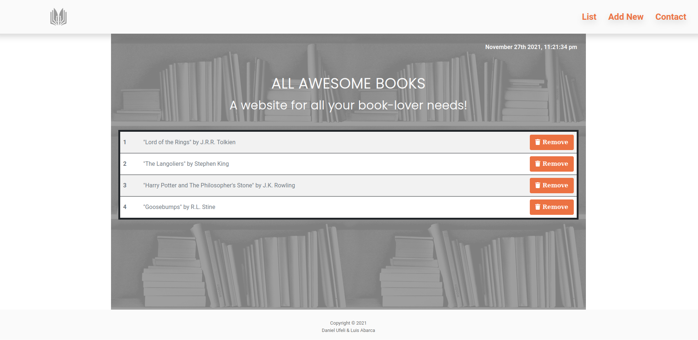
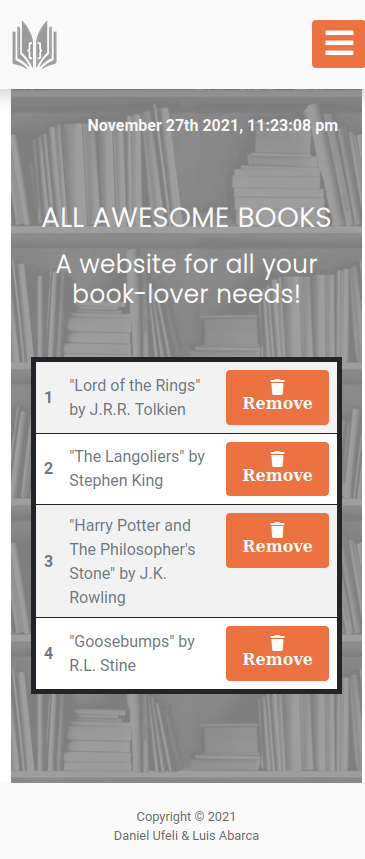

  
  
  
  
  

# Awesome Books

> A basic website that allows users to add/remove books from a list.

| Desktop version | Mobile version|
|-----------------|---------------|
|  |  |  

It will achieve that by using JavaScript objects and arrays. I will also need to dynamically modify the DOM and add basic events.

## Built With

- HTML5
- CSS3
- JavaScript
- Bootstrap
- Linters

## Live Demo
If you like, you can see a live demo of the site here:

[Live Demo Link](https://theluisabarca.github.io/AwesomeBooks/)

## Getting Started

To get a local copy up and running follow these simple example steps:

- Select the link with the code on the https code tab in the repo.
- Open a Terminal and write the command: 
> `git clone https://github.com/TheLuisAbarca/AwesomeBooks`.
- Drag the index.html to any browser.

## Test

- After cloning the project you need to run these commands

  > `npm install`
  > This command will download all the dependancies of the project

As this project counts with html, css and javascript, you will need to test the following:

- For tracking linter errors in HTML files run:

  > `npx hint .`

- For tracking linter errors in CSS or SASS  files run:

  > `npx stylelint "\*_/_.{css,scss}"`

- And for tracking linter errors in JavaScript files run:

  > `npx eslint .`

## Authors

👤 **Luis Abarca**

- GitHub: [@TheLuisAbarca](https://github.com/TheLuisAbarca)

👤 **Daniel Ufeli**

- GitHub: [@danielufeli](https://github.com/danielufeli)

## 🤝 Contributing

Contributions, issues, and feature requests are welcome!

Feel free to check the [issues page](../../issues/).

## Show your support

Give a ⭐️ if you like this project!

## 📝 License

This project is [MIT](./MIT.md) licensed.
